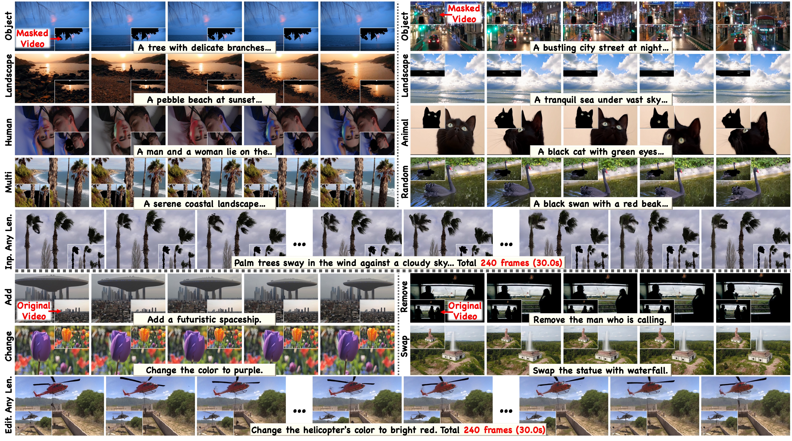
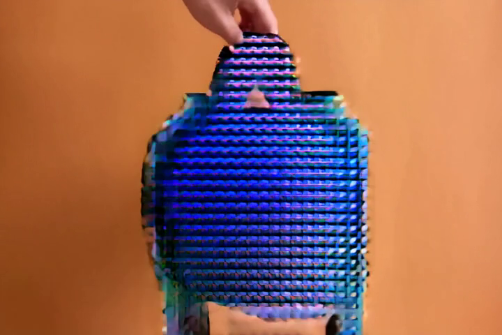
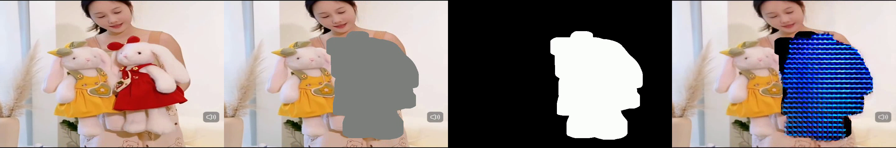
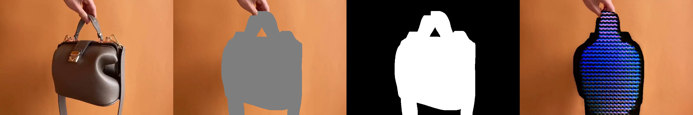
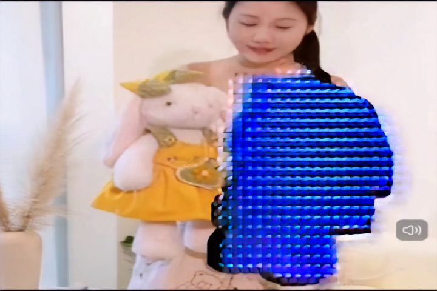
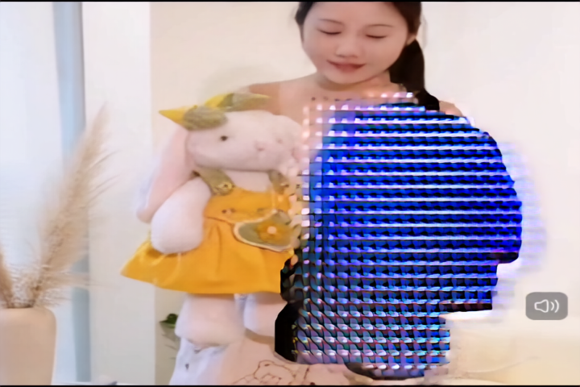
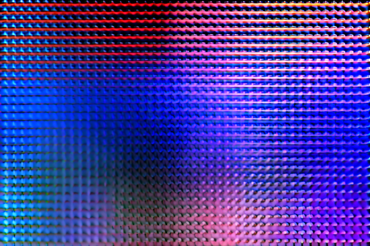
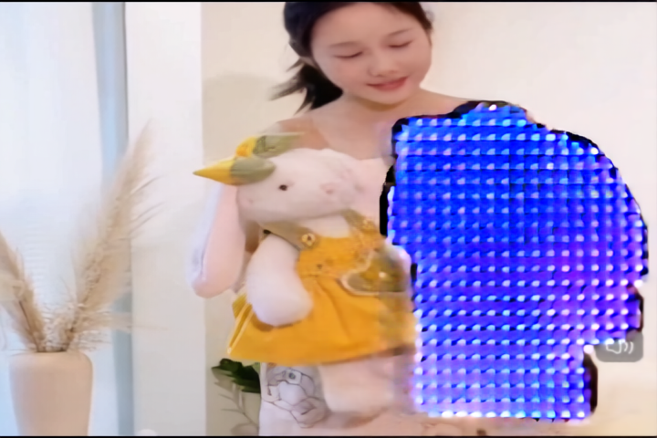
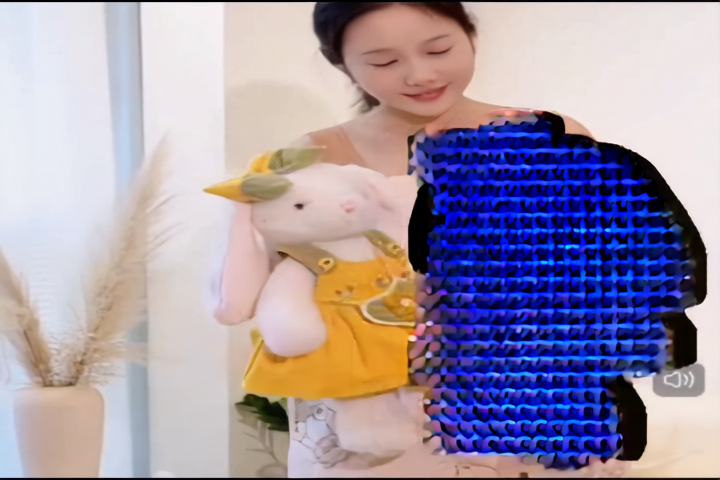
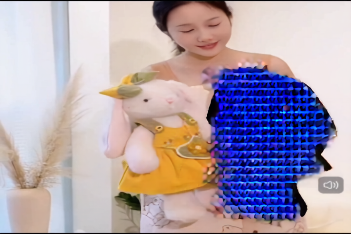

# 周报 | Weekly Report

---

## 基本信息

- **姓名：** LIU Luyan
- **日期：** 2026-04-07

---

## 1. 研究领域

视频 Inpainting（视频修复/物体替换）。使用 VideoPainter（SIGGRAPH 2025）进行视频中目标物体的去除与替换，基于 CogVideoX-5b-I2V 视频扩散模型。

VideoPainter 通过 SAM2 选中目标区域 + prompt 引导生成，可实现以下三类任务：

| 任务 | Prompt 示例 | 说明 |
|------|------------|------|
| **去除物体** | `"A clean table with soft lighting"` | 描述去掉物体后的背景 |
| **替换物体** | `"A red leather wallet on a table"` | 描述想要替换成的物品 |
| **改变属性** | `"A blue handbag held by a person"` | 描述颜色/材质等变化 |

## 2. 领域核心问题

本周的核心问题是**复现 VideoPainter 推理时出现的"LED 灯珠矩阵"伪影**。该问题阻塞了整个 VideoPainter 的应用。

### 期望效果（官方结果）

以下是 VideoPainter 官方展示的效果，inpaint 区域能生成自然、连贯的内容：



### 实际效果（我们的结果）

我们复现时，inpaint 区域出现规则的蓝色网格伪影（灯珠矩阵），完全不可用：



## 3. 技术方案

采用**系统性消元法**，每次只改变一个变量，通过对照实验逐一排除可能的原因，定位灯珠的根因。

## 4. 本周工作

---

### 4.1 Exp 1: PyTorch 版本测试（RTX 5090）

**动机：** 初始分析怀疑灯珠是 RTX 5090 Blackwell 架构 + PyTorch 2.10.0 的 CUDA kernel 兼容性问题。

**目的：** 验证更换 PyTorch 版本是否能消除灯珠。

**方法：** 在 RTX 5090 上分别测试 PyTorch 2.8.0、2.10.0、2.11.0，以及禁用 cuDNN、使用 torch.compile 等变体。

**结果：** 所有版本均出现灯珠，无差异。



**结论：** 灯珠不是特定 PyTorch 版本的问题。

---

### 4.2 Exp 0: Colab A100 测试

**动机：** Exp 1 无法区分 PyTorch 版本问题和 RTX 5090 硬件问题，需要换 GPU 验证。

**目的：** 在非 Blackwell GPU（A100）上测试，排除硬件因素。

**方法：** 在 Google Colab A100 40GB 上运行，分别测试 PyTorch 2.10.0 和官方要求的 2.4.0。

**结果：** A100 上也出现完全一样的灯珠。



**结论：** 推翻了"RTX 5090 Blackwell 硬件问题"的假设，灯珠不是 GPU 型号特有的。

---

### 4.3 Exp 2: Branch 模型 A/B 测试

**动机：** VideoPainter 的核心创新是 branch 模型（提供背景上下文信息），怀疑 branch 可能在 CPU offload 模式下未正确工作。

**目的：** 通过关闭 branch（`conditioning_scale=0`）测试其对灯珠的影响。

**方法：** 在 `pipe()` 调用中正确传递 `conditioning_scale=1.0`（ON）和 `0.0`（OFF）进行对比。

**结果：** 两者输出完全一致（pixel-level 相同），灯珠无变化。

| Branch ON (scale=1.0) | Branch OFF (scale=0.0) |
|:---:|:---:|
|  |  |

**结论：** Branch 模型不是灯珠的原因。同时发现灯珠可能来自更底层的 CogVideoX 模型本身。

---

### 4.4 Exp 3: 纯 CogVideoX I2V 测试

**动机：** Exp 2 暗示灯珠可能来自 CogVideoX 基础模型，而非 VideoPainter 的 inpainting pipeline。

**目的：** 完全去除 VideoPainter 组件，用标准 CogVideoX Image-to-Video pipeline 测试。

**方法：** 使用 `CogVideoXImageToVideoPipeline`（标准 I2V，无 branch、无 mask、无 inpainting），仅做图生视频。

**结果：** **整帧**都是灯珠矩阵，不仅限于 mask 区域。



**结论：** 灯珠来自 CogVideoX 模型本身在当前环境下的行为，不是 VideoPainter 的代码问题。

---

### 4.5 Exp 4: pipe.to("cuda") 无 CPU Offload 测试

**动机：** 官方代码使用 `pipe.to("cuda")` 直接加载到 GPU，不使用任何 CPU offload。我们一直使用 `enable_model_cpu_offload()` 因为显存不够。

**目的：** 验证 CPU offload 机制是否是灯珠的原因。

**方法：** 在 RTX 5090 上使用 `pipe.to("cuda")`，减少帧数至 13 帧以适应 32GB 显存，VAE 使用 tiling 解决解码 OOM。

**结果：** 灯珠仍然存在。



**结论：** CPU offload 不是唯一原因（至少在 RTX 5090 + PyTorch 2.10.0 上）。

---

### 4.6 Exp 5: 加载 LoRA 权重测试

**动机：** 分析官方 Gradio Demo 代码发现，官方使用了 VideoPainterID 的 LoRA 权重和 `id_pool_resample_learnable=True`，而我们一直没有加载。

**目的：** 验证 LoRA 权重是否是缺失的关键组件。

**方法：** 加载 VideoPainterID LoRA 权重 + `id_pool_resample_learnable=True` + `pipe.to("cuda")`，9 帧。

**结果：** 灯珠仍然存在。



**结论：** LoRA 权重不是灯珠的原因。

---

### 4.7 Exp 6: 完全复刻 Gradio Demo 推理逻辑

**动机：** 逐一排除后仍未解决，决定完全复制官方 Gradio Demo 的模型加载和推理逻辑。

**目的：** 用与官方 Demo 100% 一致的代码和参数运行。

**方法：** 从 `app/utils.py` 的 `load_model()` 和 `run_video_inpainting()` 直接提取代码，包括 LoRA、id_pool_resample、dilate_size=16 等所有参数。

**结果：** 灯珠仍然存在。



**结论：** 在 RTX 5090 32GB 上，即使完全复刻官方代码也无法消除灯珠。

---

## 5. 结论与发现

### 已确认排除的原因

| 假设 | 验证实验 | 结果 |
|------|----------|------|
| RTX 5090 Blackwell 硬件 | Exp 0: Colab A100 | A100 也有灯珠 |
| PyTorch 版本 | Exp 1: 2.4/2.8/2.10/2.11 | 所有版本都有 |
| Branch 模型 | Exp 2: scale=0 关闭 | 关闭后仍有 |
| Inpainting pipeline | Exp 3: 纯 CogVideoX I2V | 纯 I2V 也有 |
| CPU offload | Exp 4: pipe.to("cuda") | 仍有灯珠 |
| 缺少 LoRA 权重 | Exp 5: 加载 VideoPainterID | 仍有灯珠 |
| 代码参数差异 | Exp 6: 完全复刻 Gradio Demo | 仍有灯珠 |

### 核心发现

1. **灯珠在我们能测试的所有配置下均出现**，但官方 teaser 显示正常效果
2. 很可能 CogVideoX 模型本身的代码存在bug。VideoPainter 用的是 diffusers 0.31.0.dev0（预发布版），而官方 diffusers 后来发布了 0.31.0 正式版以及 0.32、0.33 等更新版本。如果是 dev0 的 bug，大概率在后续版本里已经修了。

## 6. 下周计划

- [ ] 检查更新diffusers，修复方法：
      1. 对比 fork 里的 CogVideoX 核心文件（transformer、VAE、scheduler）和官方 diffusers 最新版的同名文件
      2. 找出 diff（dev0 → stable 之间改了什么）
      3. 把修复 backport 到 fork 里
- [ ] 灯珠解决后，在商品视频数据集上测试 inpainting 效果
- [ ] 探索 VideoPainter 用于商品替换（prompt-guided object replacement）的可行性
- [ ] 如果未能解决，继续复现propainter

---

## 附录

### 实验文件结构
```
VideoPainter/
├── experiments/
│   ├── exp0_colab_results/        # Colab A100 测试结果
│   ├── exp1_pytorch_versions/     # PyTorch 2.8/2.10/2.11 + 变体
│   ├── exp2_branch_ab_test/       # Branch ON vs OFF 对比
│   ├── exp3_pure_cogvideox_i2v/   # 纯 CogVideoX I2V 测试
│   ├── exp4_no_offload/           # pipe.to("cuda") 测试
│   ├── exp5_with_lora/            # LoRA 权重测试
│   └── exp6_gradio_logic/         # Gradio Demo 逻辑复刻
├── test_scripts/                  # 实验脚本
├── notebooks/                     # Colab notebooks
└── reports/                       # 分析报告
```

### 官方环境 vs 我们的环境

| 项目 | 官方 | 我们 |
|------|------|------|
| GPU | A100/H100 80GB | RTX 5090 32GB / A100 40GB |
| PyTorch | 2.4.0 | 2.10.0（RTX 5090 要求） |
| GPU 加载 | pipe.to("cuda") | enable_model_cpu_offload |
| diffusers | 0.31.0.dev0 (fork) | 同 |
